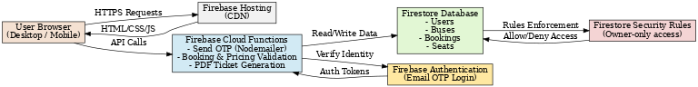

# PortkeyGo – Cloud-Based Bus Pass System

*From anywhere to everywhere.*

**Repository:** [https://github.com/vayybhav/CodeAlpha_Cloud-Based-Bus-Pass-System](https://github.com/vayybhav/CodeAlpha_Cloud-Based-Bus-Pass-System)

---

## Overview

PortkeyGo is a fully cloud-hosted online bus ticket booking system built with a serverless architecture. It allows users to search buses, select seats, book tickets, and download themed PDF tickets, all while ensuring ticket security, preventing incorrect pricing, and providing a smooth, scalable experience. The system was designed to meet CodeAlpha Task-3 requirements for the Cloud-Based Bus Pass System.

---

## Features
- **Email OTP Login** – Secure authentication via email OTP with 10-minute expiry.
- **Bus Search** – Find available buses based on selected route and date.
- **Custom Bus Listings** – Realistic, curated bus data instead of generic placeholders.
- **Interactive Seat Selection** – Real-time seat locking to prevent double-booking.
- **Server-Side Pricing Validation** – Ensures displayed prices match server-calculated totals.
- **PDF Ticket Download** – Well-formatted ticket with passenger details, bus details, travel date, and QR code.
- **Ticket Retention** – Canceled tickets remain accessible until the scheduled travel date.
- **Automatic Expired Booking Cleanup** – Removes expired bookings after departure.
- **User-Friendly Navigation** – Includes Home navigation and direct booking management.
- **Responsive Design** – Optimized for both desktop and mobile devices.
- **Scalable Cloud Backend** – Firebase Hosting, Firestore, and Cloud Functions handle high traffic seamlessly.
---

## Tech Stack

* **Frontend:** HTML, CSS, JavaScript  
* **Backend & Hosting:** Node.js, Firebase Hosting, Cloud Functions  
* **Database:** Firestore  
* **Authentication:** Firebase Auth (custom OTP flow)  
* **Email Service:** Nodemailer  
* **Security:** Firestore Rules, server-side pricing, account-bound bookings

---

## Architecture



**Workflow:**

1. User accesses the frontend served via Firebase Hosting.
2. Sensitive actions (OTP, booking confirmation, pricing) handled by Cloud Functions.
3. Firestore stores and manages bus, booking, and user data.
4. Security rules ensure only authorized access to user data.

---

## Setup & Deployment

1. Clone the repository:

```bash
git clone https://github.com/vayybhav/CodeAlpha_Cloud-Based-Bus-Pass-System
cd CodeAlpha_Cloud-Based-Bus-Pass-System
```

2. Install dependencies:

```bash
cd backend
npm install
```

3. Configure Firebase:

   * Create a Firebase project.
   * Enable Firestore, Authentication, and Hosting.
   * Set up Nodemailer credentials in Firebase Functions config.

---

## Testing

See [docs/test-report.md](docs/test-report.md) for the complete test results.

---

## Folder Structure

```
CodeAlpha_PortkeyGo/
│
├─ backend/
│   ├─ node_modules/
│   ├─ .env
│   ├─ .gitignore
│   ├─ otpStore.js
│   ├─ package-lock.json
│   ├─ package.json
│   └─ server.js
│
├─ docs/
│   ├─ screenshots/
│   ├─ architecture/
│   └─ test-report.md
│
├─ public/
│   ├─ auth.html
│   ├─ booking-confirmation.html
│   ├─ booking-confirmation.js
│   ├─ firebase-config.js
│   ├─ harry-potter.png
│   ├─ index.html
│   ├─ my-bookings.html
│   ├─ my-bookings.js
│   ├─ otp.js
│   ├─ profile.html
│   ├─ profile.js
│   ├─ script.js
│   ├─ search-results.html
│   ├─ search-results.js
│   ├─ seat-selection.html
│   ├─ seat-selection.js
│   ├─ verify-otp.html
│   └─ styles.css
│
└─ README.md
```

---

© 2025 Vaibhav Sachdeva. All rights reserved. For internship submission only.

